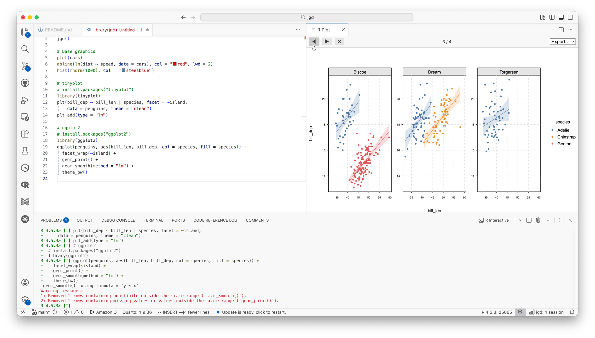

# jgd — JSON Graphics Device for R


**jgd** is a lightweight (C-based, zero dependency) R graphics device. It
works by serializing R plotting operations into JSON and then streaming to
an external renderer. A Deno-based reference server provides the primary
rendering environment, serving a browser frontend over HTTP/WebSocket. A
VS Code extension is also available as a demo client. Here's a screenshot
of jgd running in VS Code:



The **jgd** protocol is designed to be frontend-agnostic. While VS Code is the
current development focus, in principle any client able to read
(newline-delimited) JSON could use it to render R plots.

**Caveats:** The package is experimental and may have some rough edges despite
our best efforts at thorough local testing. The communication protocol between
R and the renderer is still in development and not yet stable.
Finally, we want to be transparent that this project has made _heavy_ use of
AI-assisted pair programming (Claude). It is highly doubtful that we would have
been able to put this together without AI help.

## Installation

### R package

```r
install.packages('jgd', repos = 'https://grantmcdermott.r-universe.dev')
```

### Reference server (Deno)

The reference server provides a browser-based renderer over HTTP/WebSocket.
Run it directly with Deno (no install needed):

```bash
deno run https://raw.githubusercontent.com/grantmcdermott/jgd/refs/heads/main/server/main.ts
```

Or clone the repo and run locally:

```bash
cd server && deno task start
```

### VS Code extension (optional)

A VS Code extension is available as a demo client. Download the `.vsix` from
the
[nightly release](https://github.com/grantmcdermott/jgd/releases/tag/nightly),
then install it:

```bash
code --install-extension jgd-vscode-nightly.vsix
```

Alternatively, build from source for local development:

```bash
cd vscode-ext
npm install && npm run compile
code --extensionDevelopmentPath="$(pwd)"
```

## Usage

Start the reference server, then open `http://127.0.0.1:<port>/` in your
browser (the URL is printed on startup). In a separate terminal, start R and
run the following script. If you're using the VS Code extension instead, just
run the script from the VS Code R terminal.

```r
library(jgd)
jgd()

# Base graphics
plot(1:10)
lines(1:10, col = "red", lwd = 3)
hist(rnorm(1000), col = "steelblue")
plot(cars)
abline(lm(dist ~ speed, data = cars), col = "red", lwd = 2)

# tinyplot
library(tinyplot)
plt(bill_dep ~ bill_len | body_mass, facet = ~island,
    data = penguins, theme = "clean")

# ggplot2
library(ggplot2)
ggplot(penguins, aes(bill_len, bill_dep, col = species)) +
  geom_point() +
  facet_wrap(~island) +
  theme_bw()
```

Use ◀ ▶ in the plot pane (or `Alt+Left` / `Alt+Right`) to navigate plot
history.

## Motivation

The primary motivation for this package is supporting a nicer R graphics
experience in VS Code. At present, the VS Code [R
extension](https://github.com/REditorSupport/vscode-R/wiki/Plot-viewer) provides
fairly crude "native" graphics support, since plots are displayed at PNGs. As a
result, users have for some time relied on the nice
[httpgd](https://github.com/nx10/httpgd) package for a better graphics
experience; indeed, the official R extension docs even recommend using it.
However, the `httpgd` alternative has become increasingly tricky to work with
due to repeated CRAN removals and lack of maintenance bandwidth. In brief, this
is because it embeds a full C++ SVG rendering stack and HTTP server inside the R
process, which is powerful but fragile. At the time of writing, both `httpgd`
and its core [unigd](https://github.com/nx10/unigd) dependency are unavailable
on CRAN due to a variety of C++ toolchain issues: non-API entry points, compiler
compatibility failures, etc. (See
[here](https://cran-archive.r-project.org/web/checks/2025/2025-04-23_check_results_httpgd.html)
and
[here](https://cran-archive.r-project.org/web/checks/2026/2026-02-06_check_results_unigd.html)).

**jgd** takes a different approach. First, it doesn't render anything; it just
records. All rendering happens in the client (a VS Code webview, a browser tab,
or any future frontend). Second, it is very lightweight. The core of the R
package is written in pure C with zero external dependencies. The only system
dependencies are the POSIX socket API (macOS/Linux) and Winsock (Windows),
both of which R itself already uses.

Our idea (hope) is that we can support the main features of `httpgd`, but with a
more stable and lightweight footprint. Ultimately, if the community agrees, we
might even be able to integrate this simple package into the main R extension
logic, so that we get nice graphics support in VS Code out of the box.

### What about Positron?

[Positron](https://positron.posit.co/) is a "batteries-included" fork of VS Code
by Posit PBC. It comes with many great features, including first-class support
for R (and Python) graphics. In our opinion, Positron is likely the best IDE
choice for a plurality of R users and we can happily recommend it. However, that
still leaves a non-trivial share of R users and use-cases, where a good "base"
VS Code R experience is still needed. **jgd** is aimed at supporting these
latter cases.

## Architecture

```
┌─────────────────────────────────────────────────┐
│  R Process                                      │
│                                                 │
│  jgd R package (pure C)                         │
│  ┌───────────────────────────────────────────┐  │
│  │ DevDesc callbacks → JSON serializer       │  │
│  │                     → socket client       │──┼──┐
│  └───────────────────────────────────────────┘  │  │
└─────────────────────────────────────────────────┘  │
     Unix domain sockets (macOS/Linux),              │
     named pipes (Windows), or TCP — NDJSON          │
┌─────────────────────────────────────────────────┐  │
│  Server (Deno reference server or VS Code ext.) │◄─┘
│                                                 │
│  Listener → Plot history → Canvas2D renderer    │
│                             (browser / webview) │
└─────────────────────────────────────────────────┘
```

The R package hooks into R's graphics engine via the standard `DevDesc`
callback interface. Every primitive — lines, rectangles, circles, polygons,
text, paths, raster images, clipping regions — is captured as a JSON object
and streamed over the socket. The renderer replays these operations faithfully
using the browser's Canvas2D API.

### Design principles

- **Pure C, no C++ dependencies.** The R package compiles with `R CMD INSTALL`
  on any platform R supports. No Boost, no fmt, no Asio, no system graphics
  libraries.
- **Frontend-agnostic protocol.** The JSON ops format is a simple, versioned
  schema. The Deno reference server and VS Code extension are the current
  clients, but the same stream could drive a Neovim plugin or any other
  renderer.
- **Incremental updates.** Adding a line to an existing plot sends only the new
  operations, not the entire plot. The renderer appends to the current frame.
- **Client-side scaling.** The renderer can replay the same operations at any
  resolution without round-tripping to R, enabling instant resize feedback.

## What works

- **Base graphics**: `plot()`, `hist()`, `lines()`, `points()`, `text()`,
  `abline()`, `polygon()`, `polyline()`, `rect()`, `image()`, `path()`
- **ggplot2**: Full support via no-op stubs for R 4.1+ pattern/mask/group
  callbacks
- **Plot history**: Back/forward navigation with ◀ ▶ buttons
- **Incremental updates**: `plot()` + `lines()` = one history entry
- **Text rotation**, **transparent colors**, **clip regions**, **line types**,
  **raster images** (base64-encoded PNG)
- **Auto-discovery**: `JGD_SOCKET` environment variable or `jgd-discovery.json`
  file for automatic connection
- **Export**: PNG and SVG from the toolbar dropdown, with custom dimensions
  (inches + DPI)
- **Cross-platform**: Unix domain sockets on macOS/Linux, named pipes on
  Windows (default), TCP on all platforms
- **Reference server**: Deno-based server with browser frontend over
  HTTP/WebSocket

## Roadmap

- [x] **Windows support**: Named pipes (default) and TCP transport
- [x] **Browser frontend**: Deno reference server with HTTP/WebSocket renderer
- [ ] **Protocol stabilization**: Stabilize and document the NDJSON protocol
- [ ] **CRAN submission**: Package the R side for CRAN distribution
- [ ] **R extension integration**: Incorporate the code from this package into
  the main VS Code R extension (if the upstream maintainers agree).

## Limitations

- **No PDF export**: PNG and SVG export are supported. For PDF, convert the
  exported SVG using any standard tool (e.g. Inkscape, Chrome print-to-PDF).

## Project structure

```
r-pkg/
├── DESCRIPTION
├── NAMESPACE
├── R/
│   ├── device.R          # R wrapper: jgd()
│   └── zzz.R             # .onLoad
├── src/
│   ├── device.c           # DevDesc setup and registration
│   ├── callbacks.c        # All graphics callbacks (line, rect, text, ...)
│   ├── display_list.c     # Page state and JSON frame serialization
│   ├── json_writer.c      # Streaming JSON builder (no dependencies)
│   ├── transport.c        # Socket/pipe/TCP client + discovery
│   ├── metrics.c          # Approximation-based font metrics
│   ├── color.c            # R color → CSS rgba() conversion
│   ├── png_encoder.c      # Minimal uncompressed PNG encoder + base64
│   └── init.c             # .Call registration
└── tests/testthat/        # Unit tests (transport, frame output, etc.)

server/                    # Deno reference server (HTTP/WebSocket renderer)

tests/                     # End-to-end tests and benchmarks

vscode-ext/
├── package.json
└── src/
    ├── extension.ts       # Activation, commands, env var injection
    ├── socket-server.ts   # Socket server (Unix + TCP) + NDJSON framing
    ├── webview-provider.ts # Webview panel + Canvas2D renderer
    └── plot-history.ts    # Per-session plot history management
```

## License

MIT
