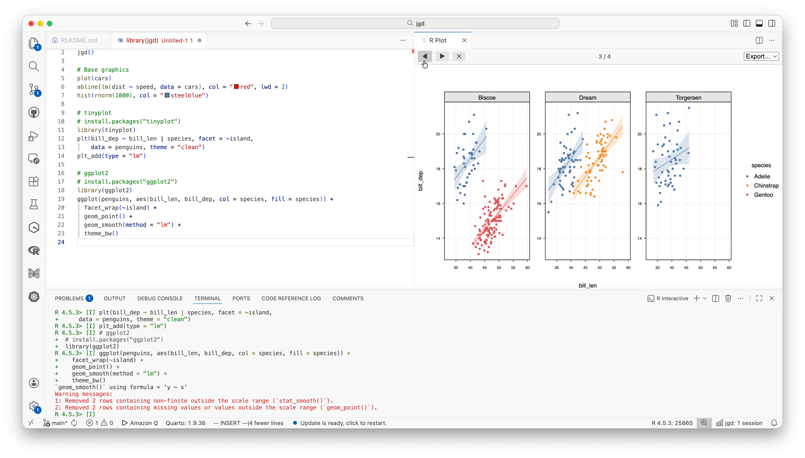
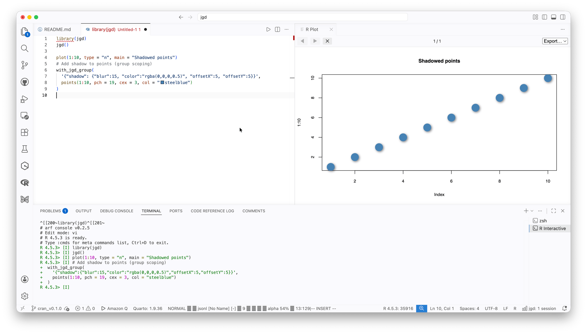

# jgd — JSON Graphics Device for R

<!-- badges: start -->
<a href="https://grantmcdermott.r-universe.dev"></a>
<a href="https://github.com/grantmcdermott/jgd/actions/workflows/r-pkg-check.yaml"></a>
<a href="https://github.com/grantmcdermott/jgd/blob/main/r-pkg/LICENSE.md"></a>
<!-- badges: end -->

**jgd** is a lightweight (C-based, zero dependency) R graphics device. It
works by serializing R plotting operations into JSON and then streaming to
an external renderer. We provide two official renderers for displaying plots:

- A **VS Code extension** with an integrated plot pane (demo below)
- A **standalone Deno server** for rendering inside a web browser

<video src="https://github.com/user-attachments/assets/913c00e9-69ab-4d0e-a3b4-18e11f8573cb" autoplay loop muted playsinline width="100%"></video>

Please note that users aren't limited to these two options. The **jgd** protocol
is designed to be frontend agnostic; any client able to read JSON could use it
to render R plots (e.g., Neovim, Emacs, or a custom web app). We encourage users
to build alternatives and would welcome additional contributions.

## Installation

To run **jgd**, you need to install the R package, as well as a frontend for
displaying plots.

### R package

We plan to submit to CRAN soon. In the meantime, please install from R-universe:

```r
install.packages('jgd', repos = 'https://grantmcdermott.r-universe.dev')
```

Or, clone this repo and install locally:

```sh
git clone https://github.com/grantmcdermott/jgd.git
R CMD INSTALL r-pkg
```

### Display frontend

You have two frontend options:

#### Option 1) VS Code extension

The simplest option is to download the `.vsix` from our
[nightly release](https://github.com/grantmcdermott/jgd/releases/tag/nightly),
then install it:

```bash
curl -fsSL \
  https://github.com/grantmcdermott/jgd/releases/download/nightly/jgd-vscode-nightly.vsix \
  -o jgd-vscode-nightly.vsix
code --install-extension jgd-vscode-nightly.vsix
```

Alternatively, you can also build and install the extension from source[^1]:

```bash
# git clone https://github.com/grantmcdermott/jgd.git ## clone first
cd vscode-ext && npm install && npm run compile \
  && npx @vscode/vsce@3.7.1 package \
  && code --install-extension jgd-vscode-0.1.0.vsix \
  && cd ..
```

[^1]: Requires [Node.js](https://nodejs.org/). For extension development, you can also use `code --extensionDevelopmentPath="$(pwd)"` from the `vscode-ext` directory to launch a separate dev host window.

#### Option 2) Deno server

If you're not using VS Code, our standalone Deno server provides a browser-based
renderer.
First [install Deno](https://docs.deno.com/runtime/getting_started/installation/),
then run directly (dependencies are fetched automatically):

```bash
deno run https://raw.githubusercontent.com/grantmcdermott/jgd/refs/heads/main/server/main.ts
```

Or, clone the repo and run locally:

```bash
# git clone https://github.com/grantmcdermott/jgd.git ## clone first
cd server && deno task start && cd ..
```

## Use

Test your installation by running some R plotting commands, like those provided
by the script below. Note that you need to call `jgd::jgd()` first to activate
the device. The steps differ slightly depending on your chosen frontend:

- **VS Code:** Once you have installed the `jgd` extension, simply execute the
below script from an R terminal inside VS Code (either via the
[R extension](https://marketplace.visualstudio.com/items?itemName=REditorSupport.r)
or by manually starting R inside the VS Code terminal).

- **Standalone server:** Start the Deno server, open `http://127.0.0.1:<port>/`
in your browser (the URL is printed on startup), then run the script from any
R session.

```r
library(jgd)
jgd()

# Base graphics
plot(cars)
abline(lm(dist ~ speed, data = cars), col = "red", lwd = 2)
hist(rnorm(1000), col = "steelblue")

# tinyplot
# install.packages("tinyplot")
library(tinyplot)
plt(bill_dep ~ bill_len | species, facet = ~island,
    data = penguins, theme = "clean")
plt_add(type = "lm")

# ggplot2
# install.packages("ggplot2")
library(ggplot2)
ggplot(penguins, aes(bill_len, bill_dep, col = species)) +
  geom_point() +
  facet_wrap(~island) +
  theme_bw()
```

Use ◀ ▶ in the plot pane (or `Alt+Left` / `Alt+Right`) to navigate plot
history, and press ✕ to remove the current plot. Resizing the pane automatically
causes the plots to be resized too. Use the `Export` dropdown to save plots as
PNG or SVG at custom dimensions (inches × DPI).



### Extension API (experimental)

**jgd** also includes an experimental API for styling effects beyond R's
standard graphics parameters. These are passed as JSON strings and forwarded to
the renderer, which can apply them using Canvas2D properties (blend modes,
opacity, shadows, CSS filters, etc.). Three levels of extension are supported:

- **Per-operation** (`jgd_ext()` / `with_jgd_ext()`): Styling applied to
  every drawing operation's graphics context.
- **Per-group** (`jgd_begin_group()` / `with_jgd_group()`): Bracket a set
  of drawing operations so the renderer can apply effects to the group as a
  whole.
- **Per-frame** (`jgd_frame_ext()` / `with_jgd_frame_ext()`): Properties
  attached to the entire frame, useful for post-processing effects.

Here's a simple example where we add shadows to the point elements of a plot.

```r
library(jgd)
jgd()

plot(1:10, type = "n", main = "Shadowed points")
# Add shadow to points (group scoping)
with_jgd_group(
  '{"shadow":{"blur":15,"color":"rgba(0,0,0,0.5)","offsetX":5,"offsetY":5}}',
  points(1:10, pch = 19, cex = 3, col = "steelblue")
)
```



See `?jgd_ext` for the full list of supported fields and guidance on
building higher-level wrapper packages. The protocol details are documented
in `?jgd_spec`.

## Motivation

The primary motivation for this package is supporting a nicer R graphics
experience in VS Code. At present, the VS Code [R
extension](https://github.com/REditorSupport/vscode-R/wiki/Plot-viewer) provides
fairly crude "native" graphics support, since plots are displayed as PNGs. As a
result, users have for some time relied on the nice
[httpgd](https://github.com/nx10/httpgd) package for a better graphics
experience; indeed, the official R extension docs even recommend using it.
However, the `httpgd` alternative has historically been tricky to rely on
due to periodic CRAN removals and maintenance challenges. This is because it
embeds a full C++ SVG rendering stack and HTTP server inside the R process,
which is powerful but fragile. Both `httpgd` and its core
[unigd](https://github.com/nx10/unigd) dependency have been removed from CRAN
multiple times due to C++ toolchain issues (non-API entry points, compiler
compatibility failures, etc.), and while they are currently available again,
we were motivated to try a different approach. The result is **jgd**.

**jgd** doesn't render anything; it just records. All rendering happens in the
client (a VS Code webview, a browser tab,
or any future frontend). Second, it is very lightweight. The core of the R
package is written in pure C with zero external dependencies. The only system
dependencies are the POSIX socket API (macOS/Linux) and Winsock (Windows),
both of which R itself already uses.

Our idea (hope) is that we can support the main features of `httpgd`, but with a
more stable and lightweight footprint. Ultimately, if the community agrees, we
might even be able to integrate this simple package into the main R extension
logic, so that we get nice graphics support in VS Code out of the box.

### What about Positron?

[Positron](https://positron.posit.co/) is a "batteries-included" fork of VS Code
by Posit PBC. It comes with many great features, including first-class support
for R (and Python) graphics. In our opinion, Positron is likely the best IDE
choice for a plurality of R users and we can happily recommend it. However, that
still leaves a non-trivial share of R users and use-cases, where a good "base"
VS Code R experience is still needed. **jgd** is aimed at supporting these
latter cases.

## Architecture

```
┌─────────────────────────────────────────────────┐
│  R Process                                      │
│                                                 │
│  jgd R package (pure C)                         │
│  ┌───────────────────────────────────────────┐  │
│  │ DevDesc callbacks → JSON serializer       │  │
│  │                     → socket client       │──┼──┐
│  └───────────────────────────────────────────┘  │  │
└─────────────────────────────────────────────────┘  │
     Unix domain sockets (macOS/Linux),              │
     named pipes (Windows), or TCP — JSONL           │
┌─────────────────────────────────────────────────┐  │
│  Server (Deno reference server or VS Code ext.) │◄─┘
│                                                 │
│  Listener → Plot history → Canvas2D renderer    │
│                             (browser / webview) │
└─────────────────────────────────────────────────┘
```

The R package hooks into R's graphics engine via the standard `DevDesc`
callback interface. Every primitive — lines, rectangles, circles, polygons,
text, paths, raster images, clipping regions — is captured as a JSON object
and streamed over the socket. The renderer replays these operations faithfully
using the browser's Canvas2D API.

### Design principles

- **Pure C, no C++ dependencies.** The R package compiles with `R CMD INSTALL`
  on any platform R supports. No Boost, no fmt, no Asio, no system graphics
  libraries.
- **Frontend-agnostic protocol.** The JSON ops format is a simple, versioned
  schema. The Deno reference server and VS Code extension are the current
  clients, but the same stream could drive a Neovim plugin or any other
  renderer.
- **Incremental updates.** Adding a line to an existing plot sends only the new
  operations, not the entire plot. The renderer appends to the current frame.
- **Client-side scaling.** The renderer can replay the same operations at any
  resolution without round-tripping to R, enabling instant resize feedback.

## What's supported

- **Base graphics**: `plot()`, `hist()`, `lines()`, `points()`, `text()`,
  `abline()`, `polygon()`, `polyline()`, `rect()`, `image()`, `path()`,
  and packages built on base graphics (e.g., **tinyplot**)
- **Grid graphics**: Full support for grid-based packages including **ggplot2**
  and **lattice**, via no-op stubs for R 4.1+ pattern/mask/group callbacks
- **Plot history**: Back/forward navigation and removal with ◀ ▶ ✕ buttons
- **Incremental updates**: `plot()` + `lines()` = one history entry
- **Text rotation**, **transparent colors**, **clip regions**, **line types**,
  **raster images** (base64-encoded PNG)
- **Auto-discovery**: `JGD_SOCKET` environment variable or `discovery.json`
  file for automatic connection (see `?jgd_spec` for details)
- **Export**: PNG and SVG from the toolbar dropdown, with custom dimensions
  (inches + DPI)
- **Cross-platform**: Unix domain sockets on macOS/Linux, named pipes on
  Windows (default), TCP on all platforms
- **Reference server**: Deno-based server with browser frontend over
  HTTP/WebSocket
- **Extended graphics context** (experimental): Blend modes, opacity, shadows,
  and CSS filters via `jgd_ext()`
- **Drawing groups** (experimental): Group drawing operations and apply
  per-group effects via `jgd_begin_group()` / `jgd_end_group()`
- **Frame-level extensions** (experimental): Frame-wide properties such as
  post-processing effects via `jgd_frame_ext()`

## Roadmap

- [x] **Windows support**: Named pipes (default) and TCP transport
- [x] **Browser frontend**: Deno reference server with HTTP/WebSocket renderer
- [x] **Protocol stabilization**: Stabilize and document the JSON protocol
  (see `?jgd-spec`)
- [ ] **CRAN submission**: Package the R side for CRAN distribution
- [ ] **R extension integration**: Incorporate the code from this package into
  the main VS Code R extension (if the upstream maintainers agree).

## Limitations

- **No PDF export**: PNG and SVG export are supported. For PDF, convert the
  exported SVG using any standard tool (e.g. Inkscape, Chrome print-to-PDF).

## Project structure

| Directory | Description |
|-----------|-------------|
| `r-pkg/` | R package (pure C, zero dependencies) |
| `server/` | Deno reference server (HTTP/WebSocket renderer) |
| `vscode-ext/` | VS Code extension |
| `tests/` | End-to-end tests |

## Acknowledgements

While we adopt a different implementation approach, **jgd** was inspired by
[Florian Rupprecht](https://github.com/nx10)'s
[httpgd](https://github.com/nx10/httpgd) and
[unigd](https://github.com/nx10/unigd) projects, which demonstrate the value of
an external web-based graphics device for R. We are also grateful to R Core for
designing and maintaining R's flexible graphics engine, whose clean C callback
interface made this project feasible.

This project has made heavy use of AI-assisted pair programming (both
Claude and Copilot). It is highly doubtful that we would have been able
to put this together without AI help.

## License

MIT
